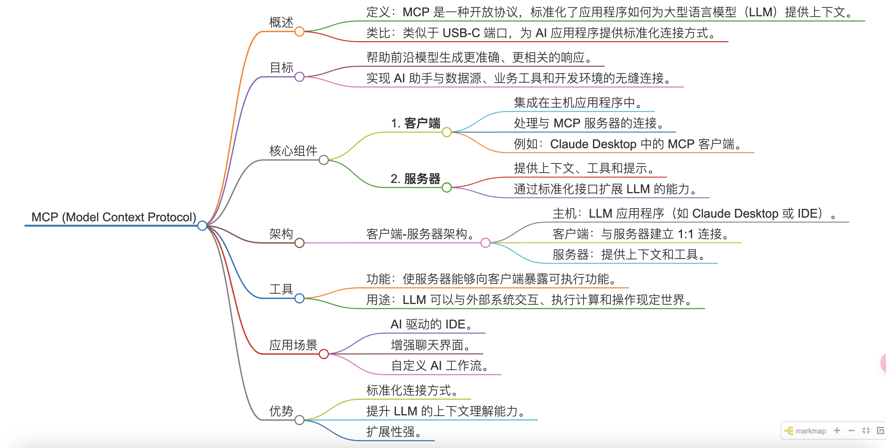
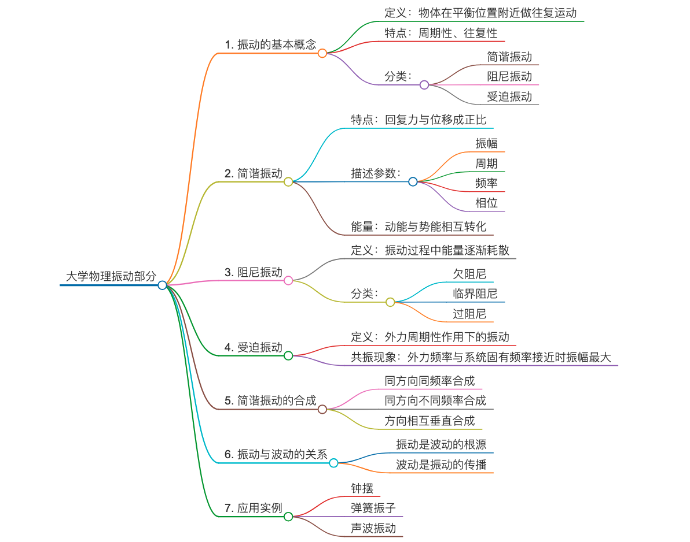
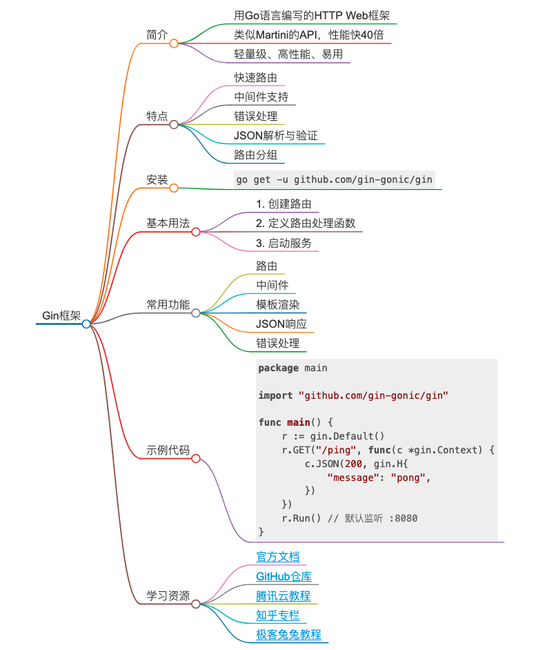

## mind-maker

思维导图绘制器，通过给入一个知识点，绘制出一张思维导图。

### 特性

- llm+mcp，可作为mcp入门参考

- eino框架实现，react模式+mcp转tools集成，可作为eino-mcp-demo

- 支持联网搜索，可针对最新的知识点进行绘制，例如最新的新闻事件，刚发布的产品，最前沿纲概念

- 上手即用，只需填入支持openai协议的模型信息即可使用

- mcp可拓展，可自行增加需要的mcp

- 生成格式为html，便于使用

- TODO：可视化前端

### 快速上手

1. 将config.json.example改名为config.json，完成model字段（llm配置），将filesystem的args中的地址改成当前地址，根据需要调整search的值（是否开启在线搜索）

> 你可以在mcps设置中自行添加需要的额外的mcp

2. `go build`编译出可执行文件

3. `./mind-maker`开始运行

4. 输入知识点，等待生成即可

5. 生成完毕，目录下会出现mind.html，打开即可看到画出的思维导图

### 画廊（生成的思维导图展示）

#### 知识点： mcp

#### 知识点：大学物理振动部分

#### 知识点：golang的gin框架

